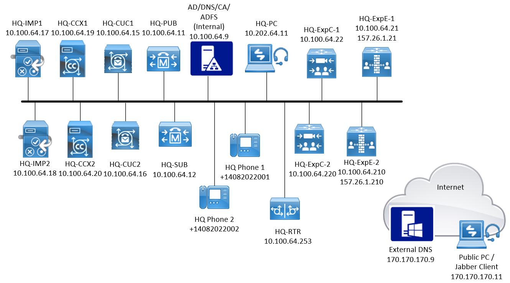

# Scenario Window Licker Solutions - Enhancing Employee Collaboration with Cisco IM&P and Jabber

You have been hired as a SR. Cisco Collaborations Engineer for the Window Licker Solutions fake glass distrbutors. Window Licker Solutions is a growing candy glass manufacturer known for its innovative and delicate confectionery products. With multiple departments including production, sales, marketing, and customer support, effective and timely communication among employees is critical to maintain operational efficiency and customer satisfaction. The company identified a need for a unified instant messaging solution integrated with their existing Cisco Unified Communications Manager infrastructure. The goal is to enable employees to communicate instantly, share presence status, and collaborate seamlessly across various devices, improving responsiveness and teamwork.

## Topology

## Users

- HQ Phone 1
  - Username: hqone
  - Telephone: +14085552001
  - Password: Cisco123
  - Pin: 12345
- HQ Phone 2
  - Username: hqtwo
  - Telephone: +14085552002
  - Password: Cisco123
  - Pin: 12345

## Requirements

1. Users should authenticate against LDAP
2. Presence should be reflected for users when signed in
3. Voicemail should be available
4. Contact search for all sites should resolve
5. Phone control should be available

